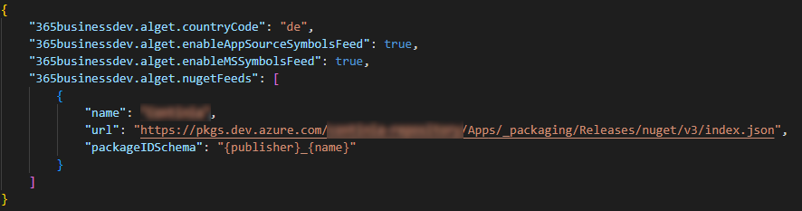

# ALGet Package Manager


This is the README for ALGet Package Manager, a Visual Studio Code extension that provides a package manager for AL projects. 

ALGet allows you to manage NuGet packages for AL projects, including installing, updating, and removing packages. 

It also provides information about packages, including dependencies and versions.

> **Good to know**<br>ALGet is currently in **preview**.<br>We are still working on performance improvements and other aspects. We are actively seeking feedback, so if you have any suggestions or encounter any issues, please let us know.

## Features at a glance

- Manage NuGet packages for AL projects
- Install, Update and Remove packages
- View package information
- View package dependencies
- View package versions
- Support for NuGet Feeds
  - Support multiple feeds, including private feeds
  - Support for NuGet.org
  - Support for Azure DevOps feeds
  - Support for GitHub feeds
  - Support for Microsoft AppSource Symbols feed
  - Support for Microsoft Symbols feed
- Restore packages for AL projects

### ALGet: Restore Packages


### ALGet: Install Package


### ALGet: Update Package


## Configuration



| Configuration | Description | Setting | Default Value |
| --- | --- | --- | --- |
| Country Code | Specifies the localization of NuGet packages to use. | `365businessdev.alget.countryCode` | `W1` |
| Prefer Apps over Symbols | Specifies whether to prefer apps over symbols when installing packages. | `365businessdev.alget.preferMSAppsOverSymbols` | `true` |
| Enable Microsoft Apps and Symbols Feed | Specifies whether to enable the public Microsoft feeds. | `365businessdev.alget.enableMicrosoftFeeds` | `true` |
| Enable Microsoft AppSource Symbols Feed | Specifies whether to enable the Microsoft AppSource Symbols feed. | `365businessdev.alget.enableAppSourceSymbolsFeed` | `true` |
| Custom NuGet Feeds | Specifies custom NuGet feeds to use. | `365businessdev.alget.nugetFeeds` | `[]` |

### Custom NuGet Feeds

Custom NuGet feeds can be added to the configuration. The following properties are available:

| Property | Description | Type | Required |
| --- | --- | --- | --- |
| Name | The name of the feed. | `string` | Yes |
| Url | The URL of the feed. | `string` | Yes |
| API Key | The API key used to authenticate with the private feed. | `string` | No |
| Package ID Schema | Specifies the pattern used to create NuGet package IDs in this feed. Omit this parameter to use default schema `{publisher}.{name}[.symbols].{appId}` | `string` | No |

```json
{
    "365businessdev.alget.nugetFeeds": [
        {
            "name": "My Custom Feed",
            "url": "https://mycustomfeed.com/v3/index.json",
            "packageIDSchema": "{publisher}.{name}.{appId}"
        }
    ]
}
```

## Good to know

### NuGet Package ID Schema

ALGet uses a default schema to process NuGet package IDs. The schema is `{publisher}.{name}[.{countryCode}].symbols.{appId}`. Some ISV partners may use a different schema for their packages. In this case, you can configure a custom schema for the feed. 

> **Note:**<br>The schema must contain the placeholder `{appId}` to allow us to add the package to your app.json file.

## Requirements

- Visual Studio Code 1.94.0 or higher
- AL Language extension _(recommended)_

## Known Issues

- None 🥳, unless you find one, then please report it.